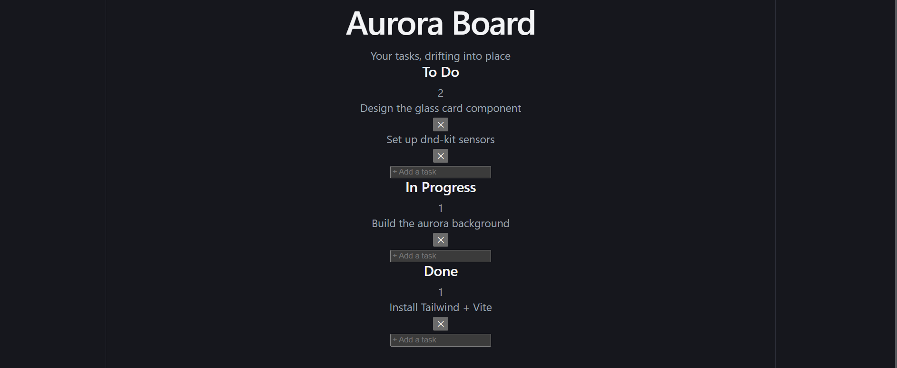

# 🌌 Aurora Board

A dark, glassmorphic Kanban-style task manager — built with React, Tailwind CSS, and dnd-kit.

**[Live Demo](#)**https://akshatha-vernekar.github.io/aurora-board/



## Features

- Drag-and-drop tasks between columns (To Do / In Progress / Done)
- Add and delete tasks per column
- Keyboard-accessible drag-and-drop (via dnd-kit)
- Data persists across refreshes using localStorage
- Fully responsive — stacks into a single column on mobile

## Tech Stack

- **React** + **Vite** — UI and build tooling
- **Tailwind CSS v4** — styling, including the dark aurora/glassmorphism look
- **@dnd-kit** — drag-and-drop and sortable lists
- **localStorage** — client-side persistence (no backend required)

## Running Locally

```bash
git clone https://github.com/Akshatha-Vernekar/aurora-board.git
cd aurora-board
npm install
npm run dev
```

Then open `http://localhost:5173`.

## What I'd Add Next

- Task due dates and priority tags
- Multiple boards
- Light/dark theme toggle
- Backend sync (currently local-only)

---

Built as a personal project by [Akshatha Vernekar].
